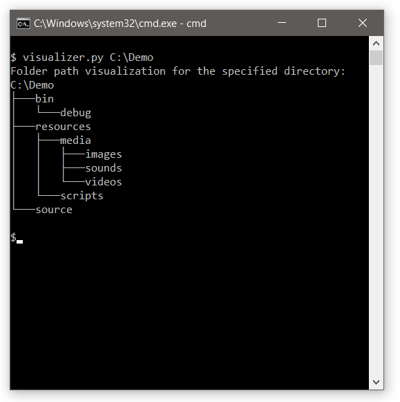

# Directory-Visualizer

Visualize the tree structure of any directory in a **command line environment**. Print all the sub-directories of either the current or provided directory. This script provides a quick way of visualizing the depth and hierarchy of a directory structure.




## Purpose

The purpose of this project is to emulate the behavior of the Windows "tree" application. Both the Windows application and this script provide almost the same functionality. The only difference being that the Windows application will also provide the drive volume information.

## Why Python:

Python is a relatively simple scripting language with a good set of tools built in. There wasn't any need to create any uncessesary classes. Python also provides good cross-platform support, which allows the script to work on any system. The systems provided by python to access the directory of any OS are strong enough for this use case.


## Usage

Display the sub-directories of the **current directory**:
```bash
$ visualizer.py
```

Display the sub-directories of a **rooted path**:
```bash
$ visualizer.py C:\rooted\path
```

Display the sub-directories of a **relative path**:
```bash
$ visualizer.py ..\relative\path
```

Display the sub-directories of a **mapped network drive**:
```bash
$ visualizer.py E:\relative\path
```

## Notes

- Requires the use of **Python 3** or newer.
- Specifying a path via command line arguments does not work for fully qualified network drives.